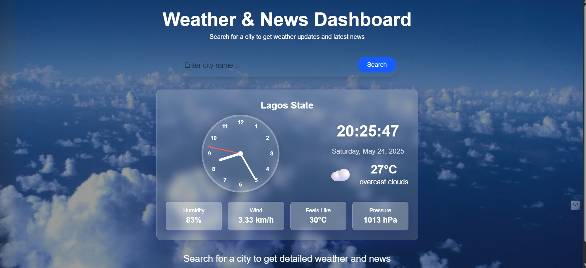
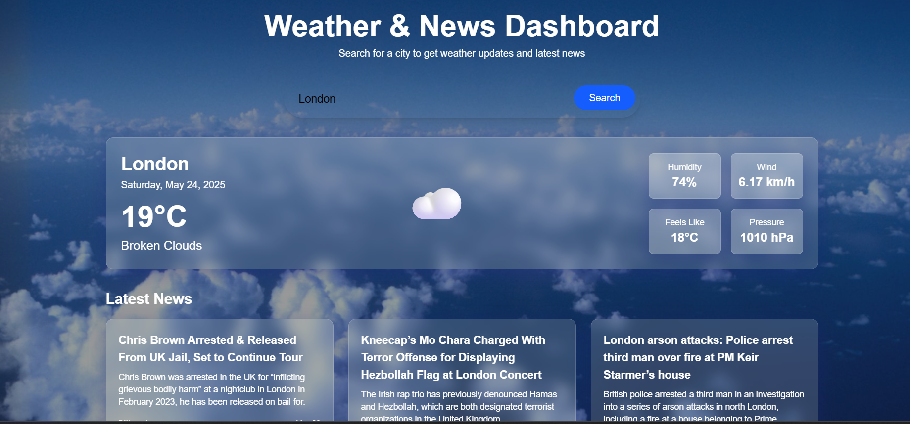

# 🌦️ Weather & News Dashboard

A simple, modern web dashboard that displays real-time weather updates and the latest news headlines based on user location or searched city. Built with Node.js, Express, EJS, and Tailwind CSS.

## 🚀 Live Demo

🌐 [Visit the App](https://weather-news-i0uv.onrender.com/)

---

## 📸 Screenshots

> 
> 


## ✨ Features

- 📍 Auto-detects user's location (GPS/IP-based fallback)
- 🌡️ Real-time weather info using [OpenWeatherMap API](https://openweathermap.org/)
- 📰 City-specific news headlines via [GNews API](https://gnews.io/)
- 🔍 Search any city for instant updates
- 📱 Responsive layout with a clock and current date
- 🎨 Clean UI built with Tailwind CSS

---

## 🛠️ Tech Stack

- **Frontend**: HTML, Tailwind CSS, JavaScript (ES Modules)
- **Backend**: Node.js, Express.js
- **Templating**: EJS
- **APIs**:
  - [OpenWeatherMap](https://openweathermap.org/)
  - [GNews](https://gnews.io/)
  - [ipapi.co](https://ipapi.co/)

---

## 🧑‍💻 Getting Started

### Prerequisites

- Node.js (v14+)
- npm

### Installation

```bash
git clone https://github.com/Imuaz/weather-news
npm install
node index.js
